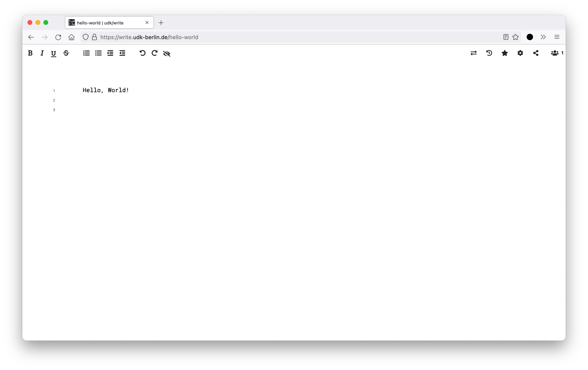

### medienhaus/

Berlin University of the Arts’ free and open-source environment for digital learning, teaching, and collaboration.

[Concept Paper](https://medienhaus.dev/) | [Twitter](https://twitter.com/medienhaus_)

 

# etherpad-skin-medienhaus

This repository contains the **medienhaus/** skin for [etherpad](https://github.com/ether/etherpad-lite).

## Development

You can customize Etherpad appearance using skins.
A skin is a directory located under `static/skins/<skin_name>`, with the following contents:

* `index.js`: javascript that will be run in `/`
* `index.css`: stylesheet affecting `/`
* `pad.js`: javascript that will be run in `/p/:padid`
* `pad.css`: stylesheet affecting `/p/:padid`
* `timeslider.js`: javascript that will be run in `/p/:padid/timeslider`
* `timeslider.css`: stylesheet affecting `/p/:padid/timeslider`
* `favicon.ico`: overrides the default favicon
* `robots.txt`: overrides the default `robots.txt`

You can choose a skin changing the parameter `skinName` in `settings.json`.

via: https://github.com/ether/etherpad-lite/edit/develop/doc/skins.md 
